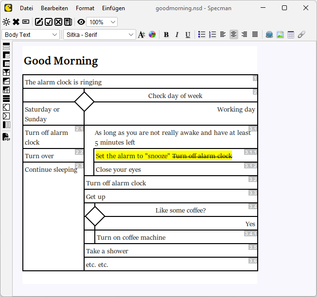

# Specman Diagramm-Editor #
Specman is a WYSIWYG editor for actogramms, which are basically Nassi-Shneiderman-like diagramms with some graphical aspects taken over from UML activity diagramms. Specman is designed for the specification of procedural workflows in software systems, and came out of more than 15 years of experience in software engineering based on standard tools like Microsoft Word, Confluence and UML.

Microsoft Word is a perfect word processor with change tracking (a crucial aspect for iterative / agile development), but control structures like loops and branches are difficult to visualize. UML activity diagramms on the other hand is very good on visualizing control structures, but change tracking and diagramm layout stability in iterative development are poor. Specman makes a difference by combining various tooling aspects in a unique way which turned out to be crucial for highly efficient, iterative software development.

## Good Morning! ##
Specman is a small Java 2D / Swing application, which builds to an executable JAR file using Maven. To run Specman, you need a Java Runtime Environment (JRE) version 17 or higher installed. The main class is `specman.Specman`. Opening the file [goodmorning.nsd](./doc/goodmorning.nsd) in Specman should bring up the following diagramm on the screen:

### File format ###

The diagramm files have a JSON-based file format which makes them machine-readable e.g. to feed code generators or AI agent based programming pipelines. However, this is not the main intention of Specman. Specman is primarily designed to produce specifications which are both human-readable and technically exact, following the central ideas of Domain-Driven Design. Software gets _designed before implementation_, following basic clean code development principles. And these designs are represented on a way which allows business stakeholders to actively participate in the design process.

### PDF export ###
Specman provides a high-quality PDF export functionality, so that the diagramms can be shared easily with everybody involved in the software engineering process. Reviewers only need a standard tool like Adobe's Acrobat Reader to open and comment the exported diagramms. See [goodmorning-export.pdf](./doc/goodmorning-export.pdf) for an example of a PDF export of the "Good Morning" diagramm.

### Change tracking ###
The yellow highlighting in the screenshot above indicates changes which were made in change mode. Similar to Microsoft Word, e.g. deleting text in change mode does not actually cause the text do disappear but displayed as crossed out with a yellow background as if someone had marked the section with a text marker. Changes in a model can therefore immediately recognized by everybody.